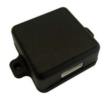

<p align="center">
  <a href="" rel="noopener">
 </a>
</p>

<h3 align="center">LINS355 Acceleration Sensor</h3>

<div align="center">

[]()
[](https://github.com/embed-coder/LINS355-accelerator/issues)
[](https://github.com/kylelobo/The-Documentation-Compendium/pulls)
[](/LICENSE)

</div>

---

<p align="center"> Read acceleration data from sensor LINS355.
    <br> 
</p>

## 📝 Table of Contents

- [About](#about)
- [Getting Started](#getting_started)
- [Running the tests](#tests)
- [TODO](#todo)
- [Authors](#authors)

## 🧐 About <a name = "about"></a>

Get the sensor data and save it as a CSV file of the following format.

<table>
  <tr>
    <th>Timestamp (UTC)</th>
    <th>Acc_x</th>
    <th>Acc_y</th>
    <th>Acc_z</th>
  </tr>
  <tr>
    <th>1633436700083</th>
    <th>0.026935</th>
    <th>0.02394</th>
    <th>9.79528</th>
  </tr>
  <tr>
    <th>...</th>
    <th>...</th>
    <th>...</th>
    <th>...</th>
  </tr>
</table>

A new CSV file will be created every 5mins in a configurable path of your choice.

Each CSV file should contain all the 100Hz acceleration data within the 5mins span:

The naming convention of each file shall be:
acc_YYYYMMDD_hhmm.csv. For eg, “acc_20220609_1240.csv”

## 🏁 Getting Started <a name = "getting_started"></a>

Clone project from this repository or download the source files in compressed format in the list of release packages.

### ➡️ Prerequisites

Dependencies:

- cmake
- libserial-dev
- googletest

Install dependency packages:

```
sudo apt update
sudo apt install -y gcc g++ git autogen autoconf build-essential \
                    cmake graphviz libgtest-dev libtool \
                    pkg-config libserial-dev socat
```

### ⛏️ Compiling

A step by step series of examples that tell you how to get a development env running.

Compile the SW

```
./build.sh
```

The output will be

```
m2m-serial test_lins355
```

## 🔧 Running the tests <a name = "tests"></a>

Run the automated tests for this SW.

### ✅ Unit test

The output will be like below

```
sudo ./run_test.sh

```

### 🚀 Running SW

Run SW with the real device: "./m2m-serial <device_file>"

```
sudo ./m2m-serial -d /dev/ttyUSB0
```

## 📝 Todo <a name="todo"></a>

The Bucket list for the future implemented features:

- Output logs to a file and set logging rotation.
- Get version from git tag for auto naming the output packages.
- Configuration for SW from json file.
- Replace data storing by a real time database for a better management and scalability.
- Documentation for software and solution architecture (UML & Graph).

## ✍️ Authors <a name = "authors"></a>

- [@embedcoder](https://github.com/embed-coder) - Idea & Initial work
